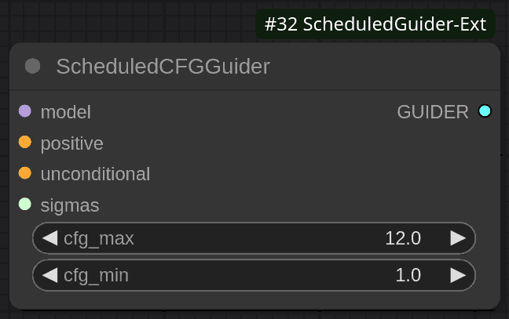
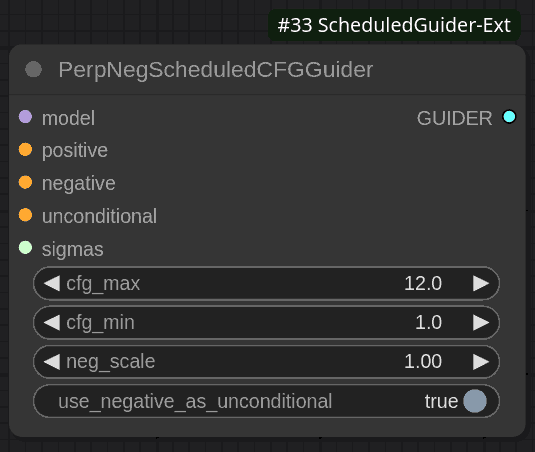

# Sheduled Guider Extension for ComfyUI

This extension contains various nodes for CFG scheduling.

## SheduledCFGGuider Node

The `SheduledCFGGuider` node is designed to guide the sampling process using a scheduled CFG (Classifier-Free Guidance) strategy. It adjusts the guidance scale dynamically based on the noise schedule during diffusion.

Thanks to Clybius. I used his [WarmupDecayCFGGuider's source code](https://github.com/Clybius/ComfyUI-Extra-Samplers/blob/52eac1b7c847d2727e0ca93ca26d9ffd77029daa/nodes.py#L675) as a base.

### Parameters

- **model**: The generative model to be used.
- **positive**: A conditioning input that specifies the desired attributes or style.
- **unconditional**: An unconditional input that serves as the base reference.
- **cfg_max**: The maximum value for the Classifier-Free Guidance scale (default: 12.0).
- **cfg_min**: The minimum value for the Classifier-Free Guidance scale (default: 1.0).
- **sigmas**: A list of sigma values defining the CFG-schedule.

### Functionality

- Dynamically calculates the CFG value based on the current timestep and CFG-schedule.

### Details

Current CFG value is mapped by `sigmas` input and scaled between `cfg_min` and `cfg_max`, based on the position of the current timestep (denoising sigma).

Increasing steps in `sigmas` input increase precision on CFG-scheduler curve, while keeping sampling steps count unchanged. You can set like 200 steps in your CFG scheduler. Guider will compute current CFG value depending on your denoising schedule.

## PerpNegSheduledCFGGuider Node

The `PerpNegSheduledCFGGuider` node extends the functionality of `SheduledCFGGuider` by incorporating negative conditioning. This allows for more nuanced control over the generated output by penalizing unwanted features.

### Parameters

- **model**: The generative model to be used.
- **positive**: A conditioning input specifying desired attributes or style.
- **negative**: A conditioning input specifying unwanted features.
- **unconditional**: An unconditional input serving as the base reference.
- **cfg_max**: Maximum value for the Classifier-Free Guidance scale (default: 12.0).
- **cfg_min**: Minimum value for the Classifier-Free Guidance scale (default: 1.0).
- **neg_scale**: Scaling factor for the negative conditioning (default: 1.0).
- **sigmas**: List of sigma values defining the CFG-schedule.
- **use_negative_as_unconditional**: Boolean flag to determine if the negative condition should act as an unconditional baseline on CFG post processing (default: True).

