# Sheduled Guider Extension for ComfyUI

This extension contains various nodes for CFG scheduling.

## SheduledCFGGuider Node

The `SheduledCFGGuider` node is designed to guide the sampling process using a scheduled CFG (Classifier-Free Guidance) strategy. It adjusts the guidance scale dynamically based on the noise schedule during diffusion.

Thanks to Clybius. I used his [WarmupDecayCFGGuider's source code](https://github.com/Clybius/ComfyUI-Extra-Samplers/blob/52eac1b7c847d2727e0ca93ca26d9ffd77029daa/nodes.py#L675) as a base.

### Parameters

- **model**: The generative model to be used.
- **positive**: A conditioning input that specifies the desired attributes or style.
- **unconditional**: An unconditional input that serves as the base reference.
- **cfg_max**: The maximum value for the Classifier-Free Guidance scale (default: 12.0).
- **cfg_min**: The minimum value for the Classifier-Free Guidance scale (default: 1.0).
- **sigmas**: A list of sigma values defining the CFG-schedule.

### Functionality

- Dynamically calculates the CFG value based on the current timestep and CFG-schedule.

### Details

Current CFG value is mapped by `sigmas` input and scaled between `cfg_min` and `cfg_max`, based on the position of the current timestep (denoising sigma).

Increasing steps in `sigmas` input increase precision on CFG-scheduler curve, while keeping sampling steps count unchanged. You can set like 200 steps in your CFG scheduler. Guider will compute current CFG value depending on your denoising schedule.

## PerpNegSheduledCFGGuider Node

The `PerpNegSheduledCFGGuider` node extends the functionality of `SheduledCFGGuider` by incorporating negative conditioning. This allows for more nuanced control over the generated output by penalizing unwanted features.

### Parameters

- **model**: The generative model to be used.
- **positive**: A conditioning input specifying desired attributes or style.
- **negative**: A conditioning input specifying unwanted features.
- **unconditional**: An unconditional input serving as the base reference.
- **cfg_max**: Maximum value for the Classifier-Free Guidance scale (default: 12.0).
- **cfg_min**: Minimum value for the Classifier-Free Guidance scale (default: 1.0).
- **neg_scale**: Scaling factor for the negative conditioning (default: 1.0).
- **sigmas**: List of sigma values defining the CFG-schedule.
- **use_negative_as_unconditional**: Boolean flag to determine if the negative condition should act as an unconditional baseline on CFG post processing (default: True).

## CosineScheduler Node

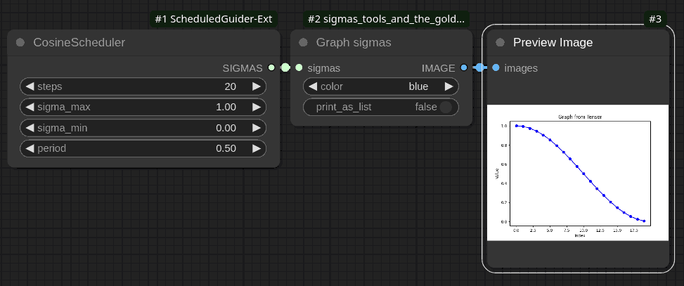

The `CosineScheduler` node generates a schedule of sigma values using a cosine function. This scheduler provides a smooth transition between defined maximum and minimum sigma values over a specified number of steps for specified period of cosine function.

### Parameters

- **steps** (`INT`): Number of discrete steps in the schedule. Determines how many sigma values will be generated.
  - Default: `20`
  - Range: `1` to `10000`

- **sigma_max** (`FLOAT`): The maximum value of sigma in the schedule.
  - Default: `1.0`
  - Range: `0.0` to `5000.0`

- **sigma_min** (`FLOAT`): The minimum value of sigma in the schedule.
  - Default: `0.0`
  - Range: `0.0` to `5000.0`

- **period** (`FLOAT`): Controls the periodicity of the cosine function applied to generate sigma values.
  - Default: `0.5`
  - Range: `0.0` to `5000.0`

### Functionality

- Computes a list of sigma values using a cosine function that transitions smoothly from `sigma_max` to `sigma_min`.
- Utilizes a cosine curve modulated by the specified `period` to adjust the rate and nature of this transition.

## GaussianScheduler Node

The `GaussianScheduler` node generates a schedule of sigma values using a Gaussian (normal) distribution.

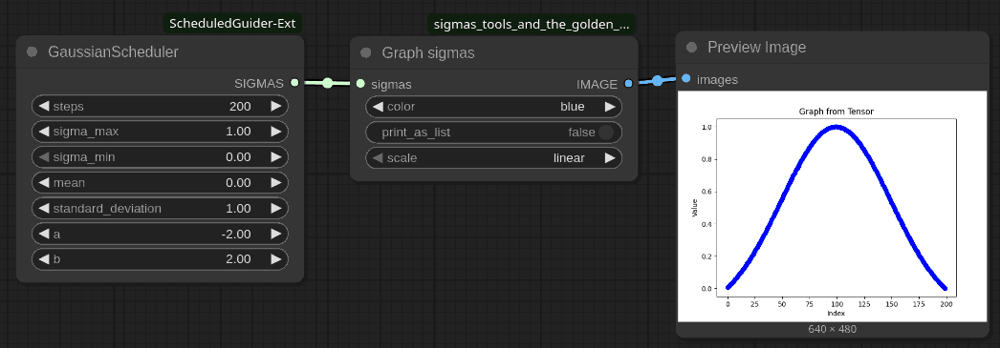

### Parameters

- **steps** (`INT`): Number of discrete steps in the schedule.
  - Default: `20`
  - Range: `1` to `10000`

- **sigma_max** (`FLOAT`): The maximum value of sigma in the schedule.
  - Default: `1.0`
  - Range: `0.0` to `5000.0`

- **sigma_min** (`FLOAT`): The minimum value of sigma in the schedule.
  - Default: `0.0`
  - Range: `0.0` to `5000.0`

- **mean** (`FLOAT`): The mean of the Gaussian distribution used to calculate sigma values.
  - Default: `0.0`
  - Range: `-5000.0` to `5000.0`

- **standard_deviation** (`FLOAT`): The standard deviation of the Gaussian distribution.
  - Default: `1.0`
  - Range: `0.0` to `5000.0`

- **a** (`FLOAT`): The lower bound of the range for generating sigma values.
  - Default: `0.0`
  - Range: `-5000.0` to `5000.0`

- **b** (`FLOAT`): The upper bound of the range for generating sigma values.
  - Default: `1.0`
  - Range: `-5000.0` to `5000.0`
  - Note: If `a > b`, their values are swapped. They must not be equal.

### Functionality

- Computes a list of sigma values based on a Gaussian distribution, smoothly transitioning from `sigma_max` to `sigma_min`.
- Utilizes the Gaussian function defined by the specified `mean` and `standard_deviation`.
- Scales the computed Gaussian values to fit within the range defined by `sigma_min` and `sigma_max`.

## LogNormalScheduler Node

The `LogNormalScheduler` node generates a schedule of sigma values using a log-normal distribution.

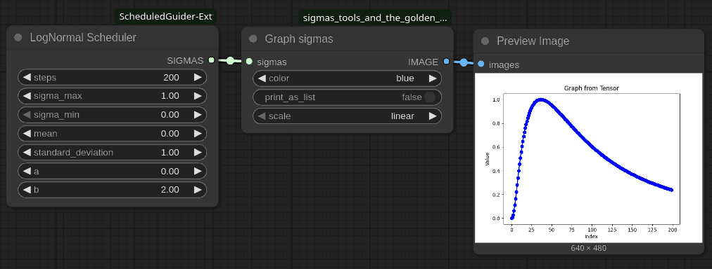

### Parameters

- **steps** (`INT`): Number of discrete steps in the schedule.
  - Default: `20`
  - Range: `1` to `10000`

- **sigma_max** (`FLOAT`): The maximum value of sigma in the schedule.
  - Default: `1.0`
  - Range: `0.0` to `5000.0`

- **sigma_min** (`FLOAT`): The minimum value of sigma in the schedule.
  - Default: `0.0`
  - Range: `0.0` to `5000.0`

- **mean** (`FLOAT`): The mean of the log-normal distribution used to calculate sigma values.
  - Default: `0.0`
  - Range: `-5000.0` to `5000.0`

- **standard_deviation** (`FLOAT`): The standard deviation of the log-normal distribution.
  - Default: `1.0`
  - Range: `0.0` to `5000.0`

- **a** (`FLOAT`): The lower bound of the range for generating sigma values.
  - Default: `0.0`
  - Range: `-5000.0` to `5000.0`

- **b** (`FLOAT`): The upper bound of the range for generating sigma values.
  - Default: `1.0`
  - Range: `-5000.0` to `5000.0`
  - Note: If `a > b`, their values are swapped. They must not be equal.

### Functionality

- Computes a list of sigma values based on a log-normal distribution, smoothly transitioning from `sigma_max` to `sigma_min`.
- Utilizes the log-normal function defined by the specified `mean` and `standard_deviation`.
- Scales the computed log-normal values to fit within the range defined by `sigma_min` and `sigma_max`.

## N/X Scheduler Node Description

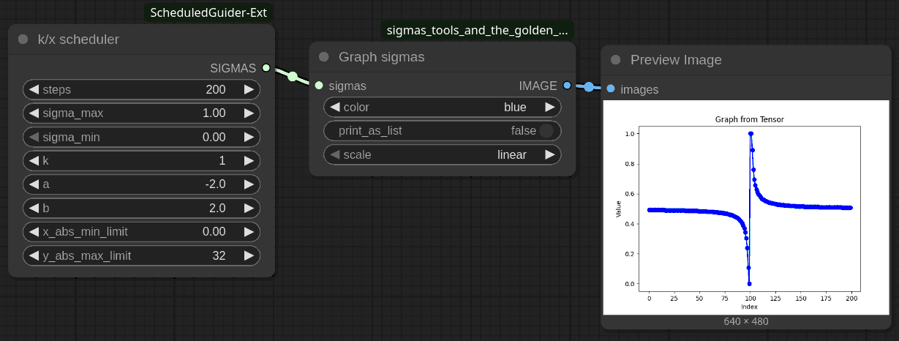

### Overview

The `n/x Scheduler` is a ComfyUI node designed for custom sampling within the CFG-schedulers category. It generates a sequence of sigma values based on an inverse function, allowing for flexible control over the sampling process.

### Inputs

- **steps** (`INT`): The number of steps for which sigma values are generated.
  - Default: 20
  - Range: [1, 10000]

- **sigma_max** (`FLOAT`): The maximum sigma value.
  - Default: 1.0
  - Range: [0.0, 5000.0]

- **sigma_min** (`FLOAT`): The minimum sigma value.
  - Default: 0.0
  - Range: [0.0, 5000.0]

- **k** (`FLOAT`): A constant used in the inverse function calculation.
  - Default: 1.0
  - Range: [0.5, 5000.0]

- **a** (`FLOAT`): The starting point of the range for x-values.
  - Default: 0.0
  - Range: [-5000.0, 5000.0]

- **b** (`FLOAT`): The ending point of the range for x-values.
  - Default: 1.0
  - Range: [-5000.0, 5000.0]

- **x_abs_min_limit** (`FLOAT`): The absolute minimum limit for x-values.
  - Default: 1e-9
  - Range: [1e-256, 2.0]

- **y_abs_max_limit** (`FLOAT`): The absolute maximum limit for y-values (sigma).
  - Default: 0.0
  - Range: [0.0, 5000.0]

### Functionality

The `get_sigmas` function generates sigma values by:

1. Ensuring `a` is less than `b`. If not, they are swapped.
2. Calculating `abs_min_x`, which ensures that `x` does not fall below a certain threshold.
3. Iterating over the specified number of steps to compute sigma values using the formula `k / x`.
4. Scaling the computed sigmas to fit within the range defined by `sigma_min` and `sigma_max`.

## ArctanScheduler Node Description

### Overview

The `ArctanScheduler` is a ComfyUI node designed for custom sampling within the CFG-schedulers category. It generates a sequence of sigma values using an arctangent function.

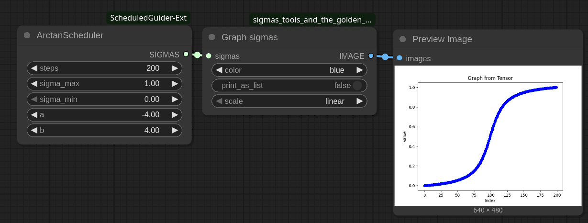

### Inputs

- **steps** (`INT`): The number of steps for which sigma values are generated.
  - Default: 20
  - Range: [1, 10000]

- **sigma_max** (`FLOAT`): The maximum sigma value.
  - Default: 1.0
  - Range: [0.0, 5000.0]

- **sigma_min** (`FLOAT`): The minimum sigma value.
  - Default: 0.0
  - Range: [0.0, 5000.0]

- **a** (`FLOAT`): The starting point of the range for x-values, scaled by π/2.
  - Default: 0.0
  - Range: [-5000.0, 5000.0]

- **b** (`FLOAT`): The ending point of the range for x-values, scaled by π/2.
  - Default: 1.0
  - Range: [-5000.0, 5000.0]

### Functionality

The `get_sigmas` function performs the following operations:

1. Ensures that `a` is less than `b`. If not, their values are swapped.
2. Converts the input range `[a, b]` to radians by multiplying each endpoint by π/2.
3. Iterates through the specified number of steps to compute sigma values using the arctangent function `atan(x)`.
4. Scales the computed sigmas to fit within the range defined by `sigma_min` and `sigma_max`.

## ConcatSigmas Node

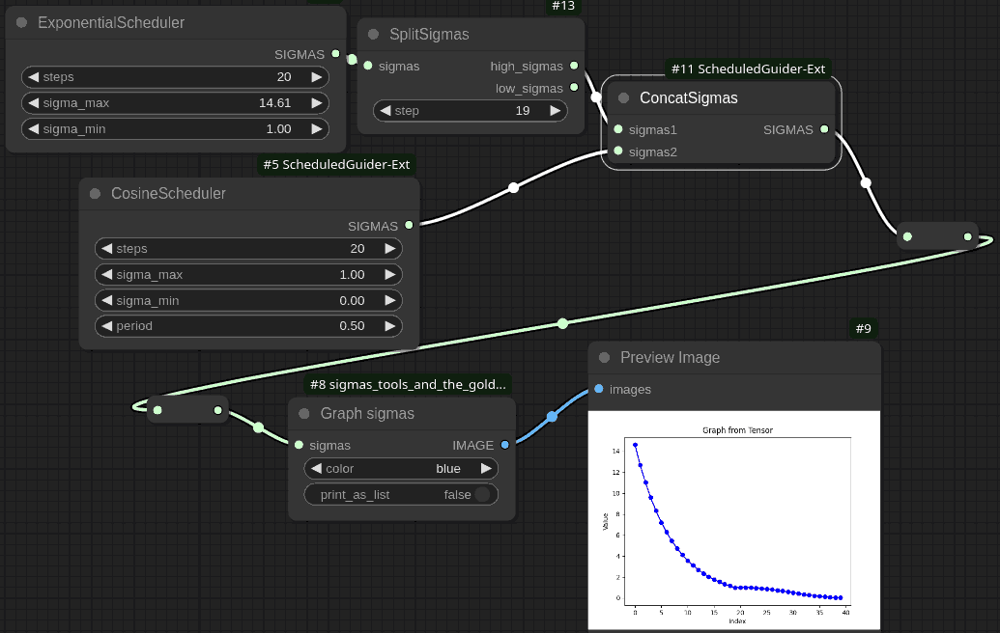

The `ConcatSigmas` node combines two sets of sigma values into a single sequence. This can be particularly useful in diffusion models or any application requiring the merging of different noise schedules.

### Parameters

- **sigmas1** (`SIGMAS`): The first set of sigma values to concatenate.
  
- **sigmas2** (`SIGMAS`): The second set of sigma values to concatenate.

### Functionality

- Takes two input arrays of sigma values (`sigmas1` and `sigmas2`) and concatenates them into a single array.

## InvertSigmas Node

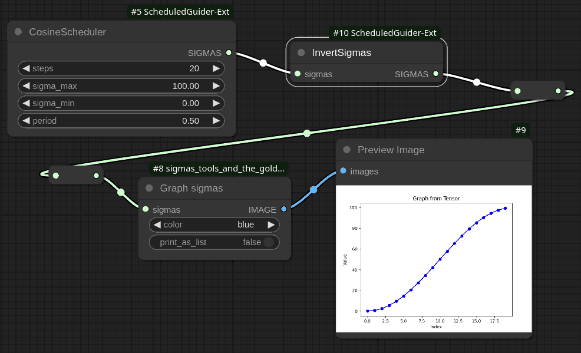

The `InvertSigmas` node inverts the sequence of sigma values such that each value becomes symmetrical around the midpoint between the maximum and minimum sigma values in the original sequence.

### Parameters

- **sigmas** (`SIGMAS`): An array of sigma values to be inverted.

### Functionality

- Calculates the maximum (`sigma_max`) and minimum (`sigma_min`) values within the input sigma values.
- Inverts each sigma value according to the formula:  
  \[
  \text{inverted\_sigma}[i] = \sigma_{\text{max}} - \sigma[i] + \sigma_{\text{min}}
  \]
  This transformation reflects each sigma value about the central point between `sigma_max` and `sigma_min`.

## OffsetSigmas Node

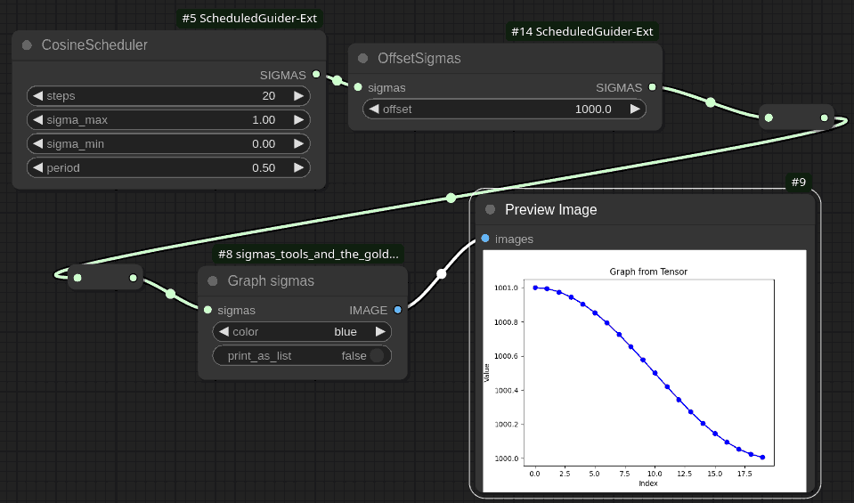

The `OffsetSigmas` node applies an additive offset to each sigma value in a given sequence.

### Parameters

- **sigmas** (`SIGMAS`): An array of sigma values that will be adjusted by the specified offset.
  
- **offset** (`FLOAT`): The amount by which each sigma value will be incremented.
  - Default: `1.0`
  - Step: `0.1`

### Functionality

- Iterates through each sigma value in the input array and adds the specified `offset`.

## SplitSigmasByValue Node

The `SplitSigmasByValue` node divides an array of sigma values into two separate arrays based on a specified threshold value. This can be useful in diffusion models or other processes where you need to handle different ranges of noise levels separately.

### Parameters

- **sigmas** (`SIGMAS`): An array of sigma values that will be split into two groups.
  
- **value** (`FLOAT`): The threshold value used to determine the split point.
  - Default: `1.0`
  - Minimum: `0.0`
  - Maximum: a very large number —`2^60`

### Functionality

- Iterates through the array of sigma values.
- Splits the sigma values into two arrays:
  - `high_sigmas`: Contains all sigma values greater than the specified `value`.
  - `low_sigmas`: Contains all sigma values less than or equal to the specified `value`.
- Returns two arrays, `high_sigmas` and `low_sigmas`, representing the split groups.

### Usage

This node is particularly useful when you need to apply different processing steps to high and low noise levels in a schedule. For example, in a diffusion model, you might want to treat steps with higher noise differently from those with lower noise.

## PredefinedLogarithm Node Description

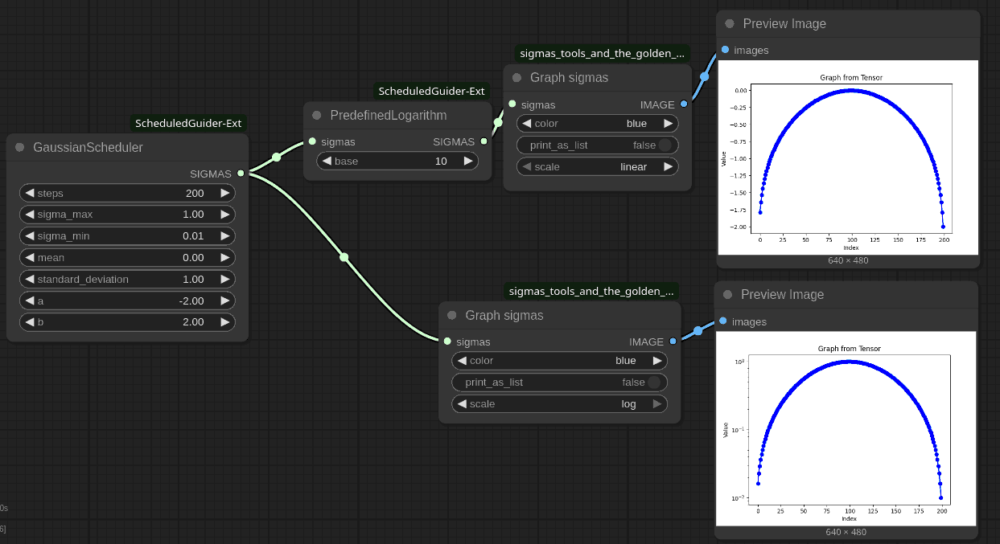

### Overview

The `PredefinedLogarithm` node is part of the custom sampling category in ComfyUI. It allows to apply a logarithmic transformation to a sequence of sigma values using predefined bases: natural logarithm (`e`), base 10, or base 2.

### Inputs

- **sigmas** (`SIGMAS`): The input sigma values that need to be transformed.
  
- **base** (`ENUM`): The logarithm base to be used for transformation.
  - Options: `"e"`, `"10"`, `"2"`
  - Default: `"e"`

### Functionality

- Applies the specified logarithmic transformation to each sigma value.
- Supports three predefined bases:
  - Natural logarithm (`e`)
  - Base 10 logarithm
  - Base 2 logarithm

---

## CustomBaseLogarithm Node Description

### Overview

The `CustomBaseLogarithm` node also belongs to the custom sampling category in ComfyUI. It allows to specify any positive real number as the base for the logarithmic transformation of sigma values.

### Inputs

- **sigmas** (`SIGMAS`): The input sigma values that need to be transformed.

- **base** (`FLOAT`): The base of the logarithm to be applied.
  - Default: 2.0
  - Range: [1.1, ∞)

### Functionality

- Transforms each sigma value using a logarithm with a user-defined base.
- Allows for highly customizable transformations based on specific requirements.

## PredefinedExponent Node Description

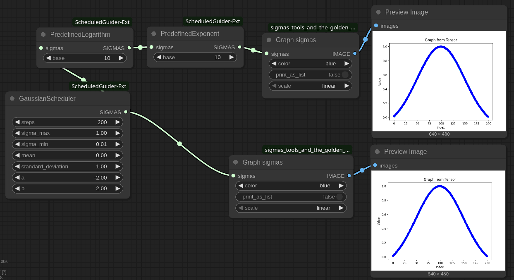

### Overview

The `PredefinedExponent` node is part of the custom sampling category in ComfyUI. It allows to apply an exponential transformation to a sequence of sigma values using predefined bases: natural exponent (`e`), base 10, or base 2.

### Inputs

- **sigmas** (`SIGMAS`): The input sigma values that need to be transformed.
  
- **base** (`ENUM`): The base for the exponential transformation.
  - Options: `"e"`, `"10"`, `"2"`
  - Default: `"e"`

### Functionality

- Applies the specified exponential transformation to each sigma value.
- Supports three predefined bases:
  - Natural exponent (`e`)
  - Base 10
  - Base 2

## Usage

This node is ideal for reverting logarithmic transformations applied to sigma schedules, enabling users to scale their sigma values exponentially. It's particularly useful when users want to revert previously applied logarithmic scales back to their original form.

---

## CustomExponent Node Description

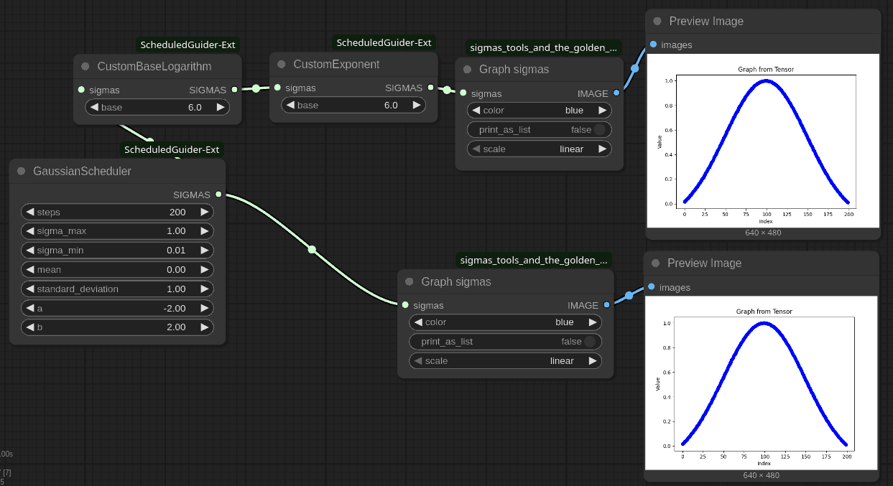

### Overview

The `CustomExponent` node also belongs to the custom sampling category in ComfyUI. It allows to specify any positive real number as the base for the exponential transformation of sigma values.

### Inputs

- **sigmas** (`SIGMAS`): The input sigma values that need to be transformed.

- **base** (`FLOAT`): The base of the exponential function to be applied.
  - Default: 2.0
  - Range: [1.1, ∞)

### Functionality

- Transforms each sigma value using an exponential function with a user-defined base.
- Allows for highly customizable transformations based on specific requirements.

---

## SigmasToPower Node Description

### Overview

The `SigmasToPower` node is part of the custom sampling category in ComfyUI. It allows to raise each sigma value to a specified power, providing a straightforward way to adjust the distribution of sigma values.

## Inputs

- **sigmas** (`SIGMAS`): The input sigma values that need to be transformed.

- **power** (`FLOAT`): The exponent to which each sigma value will be raised.
  - Default: 2.0
  - Step: 0.1

## Functionality

- Raises each sigma value to the specified power.
